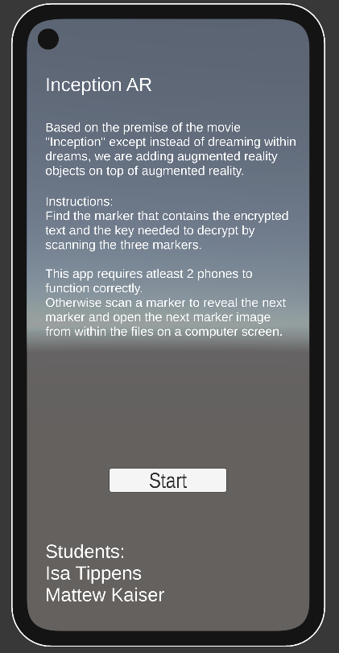

# InceptionAR

This app is made for the COS 738 Assignment 1 Group assigment

Based on the premise of the movie "Inception" except instead of dreaming within dreams, we are adding augmented reality objects on top of augmented reality.

## Requirements

- Install vuforia engine for unity within the unity editor for this project: https://developer.vuforia.com/downloads/sdk

## Instructions

Find the marker that contains the encrypted text and the key needed to decrypt by scanning the three markers.

This app requires atleast 2 phones to function correctly.

Otherwise scan a marker to reveal the next marker and open the next marker image from within the files on a computer screen.

Markers can be found in the markers folder

## Demo Video
[Google Drive](https://drive.google.com/file/d/13dEo6fOmQ-hiGyDVa_OrcwoiWZbBtwcv/view?usp=drive_link)
